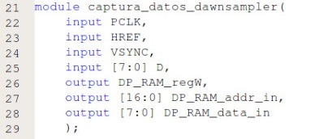

## ELECTRÓNICA DIGITAL 1 2019 -2 UNIVERSIDAD NACIONAL DE COLOMBIA 
## TRABAJO 02- diseño y prueba del HDL para la cámara OV7670
BYRON ADOLFO ERAZO CHALUPUD
JHON EDISON BOHORQUEZ MARTINEZ

## Introducción 
En este trabajo se realiza el diseño e implementación de la captura de datos de la cámara "captura_datos_downsampler" según la configuración 320x240 16b pixel. Además de esto se realiza la adaptación del bloque PLL, teniendo en cuenta que la señal de reloj viene de la FPGA Spartan 6 y la seleccionada por el grupo para la implementación del proyecto corresponde a la Artix 7, así como la adaptación de los datos para que se almacenen en la memoria, teniendo en cuenta que el formato debe ser RGB332. Una vez diseñado e implementado el bloque "captura_datos_dawnsampler", se procede a instanciarlo en el **test_cam.v** para probar la funcionalidad del diseño.

## Diseño e Impteción del Bloque captura_datos_downsampler.v
Para el diseño de este modulo se tienen en cuenta como señales de entrada las de sincronia que vienen de la camara (PCLK, D, VSYNC Y HREF) y las que van a DP_RAM (DP_RAM_regW, DP_RAM_addr_in, DP_RAM_data_in) como salidas.

La señal PCLK, es la señal que indica cuando deben ser leído cada uno del byte de información, por lo que será la señal de control y a través de posedge cada vez que se produzca un flanco de subida esta deberá ejecutar el código que permita leer la información. Además de esto se debe adaptar al formato RGB332 el cuál tendrá un tamaño de 8 bits.
 

 

Para diseñar e implementar la captura de datos según la configuración seleccionada en el Work01, se deberá adaptar los datos para que se almacene en la memoria el pixel con el formato RGB332. Según el esquema de trabajo una vez se tenga el diseño "captura_datos_downsampler" se deberá instanciar el bloqlue HDL en el test_cam.v y proceder a probar la funcionalidad del diseño. Para lo cual se debera analizar el proyecto propuesto ***test_cam.xise*** junto con la figura siguiente.  

En la figura anterior se observa que se debe adicionar las señales de amarillo y el bloque ***captura_datos_downsampler*** para completar el el proyecto ***test_cam.xise***. Se adecuo el bloque azul ***PLL*** a la FPGA Artix7.  

**MATERIAL**   
Para realizar el trabajo se hace uso del siguiente material:   

* Pantalla con entrada VGA y cuya resolución sea 640x480.
* FPGA que cuenta con puerto VGA.
* Cable VGA.
* Plantilla del proyecto sugerido [WP02](https://classroom.github.com/g/fTcztVJQ) .
* Datasheet de la cámara OV7670.

## Desarrollo

El paquete de trabajo debe desarrollar el siguiente bloque funcional:

Para lo cual, la captura de datos debe ser acorde al funcionamiento de la cámara. para ello debe analizar la siguiente gráfica:

**1. Diseñar el sistema digital de captura de los pixeles de la cámara. No es necesario incluir las señales de control  Xclk, pwdn y reset, estas están descritas en el top del proyecto.**  

para desarrolar el software que permita ella captura de datos de la camara se debe tener encuenta las senales involucradas en el proceso  D[7:0], PCLK, VSYNC y HREF.
Los datos generador por estas señales  se almmacenan en un registro de 8 bits, ya que se va utilizar el formato RGB 332 se debe instanciar  la direccion donde se almacena cada pixel que se crea por las señales de entrada que vienen de la camara,PCLK   el cual permite que los datos se almacenen de manera sincronica entre la camara y la memoria. HREF  transmision de informacion de pixeles, VSYNC idica el inicio y la terminacion de la captura de datos 

2. Diseñar el downsampler y transmitir la información al buffer de memoria. Recuerde la memoria se ha diseñado para almacenar el pixel en formato RGB332, y almacenar 3 bit para el color Rojo y Verde y 2 bit para el color Azul. Si usted, por ejemplo, selecciona el formato RGB565 de la cámara debe convertir los 5 bit de rojo en 3 bit.

***RECUEDE: Es necesario documentar el módulo diseñado con los respectivos diagramas funcionales y estructurales y registrar la información en README.md ***

Una vez clone el repositorio, en su computador de la plantilla del proyecto [WP02](https://classroom.github.com/g/fTcztVJQ), realizar lo siguiente: 

3. Revisar si el bloque PLL, `clk_32MHZ_to_25M_24M.v` (diagrama azul de la figura 1), propuesto en el bloque test_cam.v, cumple con las necesidades de reloj de entrada y salida para la plataforma utilizada. Recuerde el sistema requiere además de los 32, 50 o 100 Mhz de entrada, generar dos señales de reloj de 25Mhz y 24 Mhz para la pantalla VGA y la Cámara respectivamente. En este sentido, el archivo `clk_32MHZ_to_25M_24M.v` se encuentran en el interior de la carpeta `hdl/scr/PLL`, se debe modificar. 

Para este hito se recomienda generar un nuevo PLL con `Clocking Wizard`. en el IDE de ISE debe utilizar `tools -> Core Generator ...` y general el ip con Clocking Wizard. Una vez, generado el nuevo bloque de Clk:
* Copiar el archivo en la carpeta `hdl/scr/PLL`.
 	* Remplazar en el proyecto **test_cam.xise**, el archivo `clk_32MHZ_to_25M_24M.v` por el generado pro ustedes.
 	* Cambiar los datos necesarios en el archivo `test_cam.v` para instanciar el nuevo PLL.
 	* Documentar en README.md el proceso realizado.

4. Modificar el módulo `test_cam.v` para agregar las señales de entrada y salida necesarias para la cámara (señales amarillas del diagrama). 
5. Instanciar el módulo diseñado en el hito 1 y 2 en el módulo `test_cam.v`.
6. Implementar el proyecto completo y documentar los resultados. Recuerde adicionar el nombre de las señales y módulos en la figura 1 y registre el cambio en el archivo README.md

### Implementación 

Al culminar los hitos anteriores deben:

1. Crear el archivo UCF.
2. Realizar el test de la pantalla. Programar la FPGA con el bitstream del proyecto y no conectar la cámara. ¿Qué espera visualizar?, ¿Es correcto este resultado ?
3. Configure la cámara en test por medio del bus I2C con ayuda de Arduino. ¿Es correcto el resultado? ¿Cada cuánto se refresca el buffer de memoria ?
4. ¿Qué falta implementar para tener el control de la toma de fotos ?

***RECUEDE: Es necesario documentar la implementación y registrar la información en README.md, lo puede hacer con ayuda de imágenes o videos***
